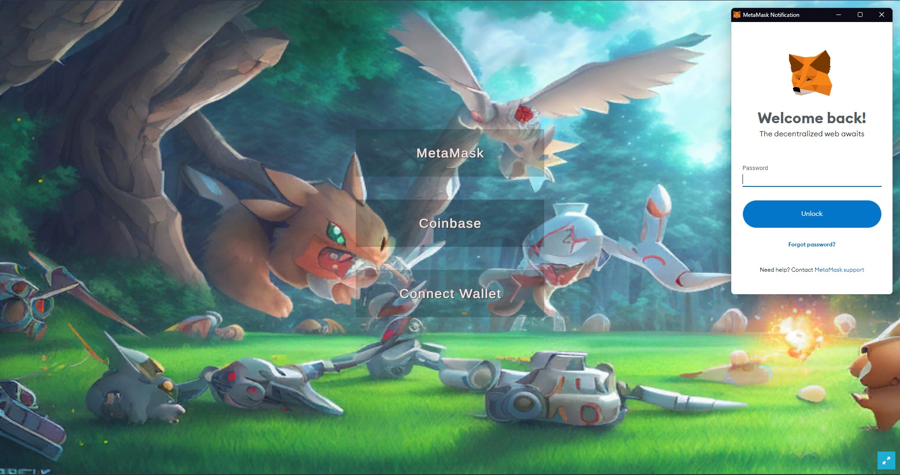
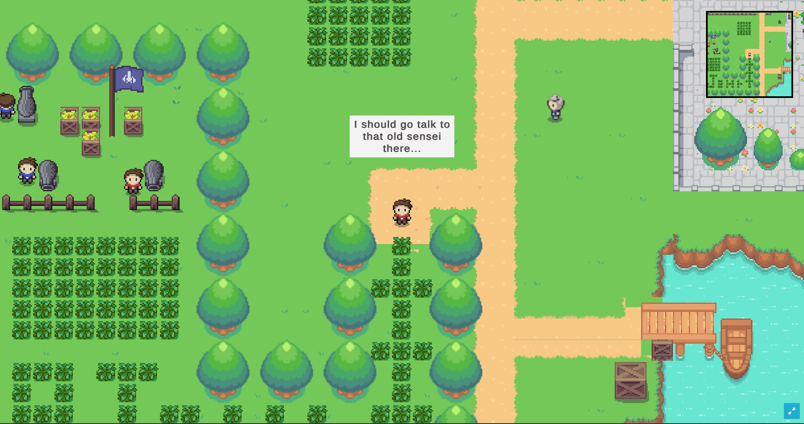

<a name="readme-top"></a>

[![Contributors][contributors-shield]][contributors-url]
[![Forks][forks-shield]][forks-url]
[![Stargazers][stars-shield]][stars-url]
[![Issues][issues-shield]][issues-url]
[![MIT License][license-shield]][license-url]

<div align="center">
  <a href="https://github.com/Yukino2002/Bokeverse">
    
  </a>

<h3 align="center">Bokeverse</h3>

  <p align="center">
    Explore the decentralized world of Bokeverse!
    <br />
    <a href="https://youtu.be/4CLOIO5XweI">View Demo</a>
    ·
    <a href="https://github.com/Yukino2002/Bokeverse/issues">Report Bug</a>
    ·
    <a href="https://github.com/Yukino2002/Bokeverse/issues">Request Feature</a>
  </p>
</div>

## Table of Contents
<details> 
  <ul>
    <li>
      <a href="#about-the-project">About The Project</a>
      <ul>
        <li><a href="#game-mechanics">Game Mechanics</a></li>
        <li><a href="#technologies-used">Technologies Used</a></li>
      </ul>
    </li>
    <li>
      <a href="#getting-started">Getting Started</a>
      <ul>
        <li><a href="#prerequisites">Prerequisites</a></li>
        <li><a href="#installation">Installation</a></li>
        <li><a href="#running-the-game">Running the game</a></li>
        <li><a href="#deploying-the-smart-contract">Deploying the smart contract</a></li>
        <li><a href="#deploying-the-website">Deploying the website</a></li>
        <li><a href="#minting-bokemonsnfts-to-your-account">Minting Bokemons(NFTs) to your account</a></li>
        <li><a href="#creating-a-qr-code-to-scan">Creating a QR Code to Scan</a></li>
      </ul>
    </li>
    <li>
      <a href="#usage">Usage</a>
      <ul>
        <li><a href="#demo-links">Demo Links</a></li>
        <li><a href="#prerequisites">Prerequisites</a></li>
        <li><a href="#playing-the-game">Playing the Game</a></li>
        <li><a href="#navigating-the-website">Navigating the Website</a></li>
      </ul>
    </li>
    <li><a href="#roadmap">Roadmap</a></li>
    <li><a href="#contributing">Contributing</a></li>
    <li><a href="#license">License</a></li>
    <li><a href="#acknowledgements">Acknowledgements</a></li>
    <li><a href="#contact">Contact</a></li>
  </ul>
</details>

## About The Project

Although we started working on the project on January 18th, it's true that a significant amount of progress has been made after January 25th, as can be seen from the commit history. I hope we will be judged accordingly. Thank you.


The game is a decentralized 2D open-world RPG with turn-based battles. It is set in a fantasy world, allowing players to explore, fight monsters and possess NFT characters and collectibles registered to their wallet address. We have also included a trading marketplace for NFTs and a QR code generation system to easily access and purchase these NFTs.

[Youtube Demo](https://youtu.be/4CLOIO5XweI)

<p align="right">(<a href="#readme-top">back to top</a>)</p>

## Game Mechanics

The game is made using Unity. As a game engine, Unity is able to provide many of the most important built-in features that make a game work. That means things like physics, animations, 3D/2D rendering, collision detection etc. We can create different game objects and add components to provide them with functionality, and make them interact with each other. These components can be in-built components provided by Unity, or custom scripts that we write ourselves in C#.

On start, the user must connect their wallet. Then, using the Thirdweb UnitySDK, we create an instance of our game contract within the game and fetch all the bokemons(NFTs) the player owns. The metadata is fetched from the contract and Scriptable objects are instantiated to use in the game as bokemons. Now, they can battle with these bokemons, and with the help of UnitySDK, we are able to update the experience level of the bokemons accordingly on the blockchain, and then update it in the game as well.

The major game scenes/objects are as follows:

- `Grid`:
  This is the main map of our game. It is a grid of 2D array of tiles that the player can move around on. Different layers of tiles are used to create the background, obstacles, and other objects in the game.

- `Player`:
  This is the player character. It is a 2D sprite, with walking animations attatched using a blend tree. The player can move around the map using the arrow keys. It has the PlayerController and BokemonParty script attatched to it, which handles the behaviour of the player and other game objects.

- `GameController`:
  This is the main game controller. It is used to manage the game state, like free roam, battle, start menu etc. and other game objects. It has the GameController script attatched to it, which handles these tasks.

- `BattleSystem`:
  This is the battle controller. It is used to manage the battle state, like turn order, player turn, enemy turn etc, animations associated with the battle, and setting up the battle huds as well. It has the BattleSystem script attatched to it, which handles these tasks.

- `MenuSystem`:
  This is the start menu canvas. It asks the player to connect their wallet to the game, and then allows them to start the game.

- `SDKManager`:
  This is the Thirdweb UnitySDK manager. It creates an isntance of the sdk and is used to connect the game to the blockchain, and to interact with the smart contract.

You can find all the scripts in the `/Bokemon/Assets/Scripts` directory. The primary game scripts are as follows:

- `PlayerController`:
  This script handles the movement of the player character. It also handles the collision detection with the obstacles, the movement of the camera, the detection of encounters with rogue bokemons in the grass etc.

- `GameController`:
  It handles the transition between the game states, free roam, start and end of battles etc. It has also has the functions for connecting the wallet, and handles the rendering of cameras.

- `BokemonParty`:
  This script handles the behaviour of the player's bokemons. It is responsible for fetching the metadata from the contract, writing transactions to update it, rewarding started bokemon, rendering of the bokemons in the party, and the switching of the bokemons in the party etc.

- `BattleSystem`:
  This script handles the behaviour of the entire battle system. It is responsible for setting up the battle, rendering the battle huds, handling the turn order, and the animations associated with the battle etc.

- `BokemonBase`:
  This script is the base class for all the bokemons. It defines the structure of the bokemon, and the functions that can be used to interact with it.

- `Bokemon`:
  This script is the class for the bokemon that the player owns. It inherits the BokemonBase class, and has information about the bokemon's experience level, elemental type, damage details and the moves it can use in battle.

### Game Smart Contract

The smart contract that the Bokeverse game runs on is a non-fungible token (NFT) contract that is built on the ERC1155Base contract by thirdweb which implements the ERC1155 NFT standard along with some additional functionality. This contract allows the creation of unique, collectible bokemons that can be owned by users and can have a unique experience level assigned to them.

The contract includes the following functions:

- `MintTo`: 
  This function is responsible for minting new bokemons. It takes in parameters such as the recipient's address, the token ID, token URI, and the amount to be minted. This function also handles assigning a unique token ID to the bokemon if none is provided.

- `Mint`: 
  This function is a higher-level implementation of the MintTo function that takes in additional parameters such as the experience level of the bokemon being minted.

- `GetBokemon`: 
  This function returns the token URI and experience level of a bokemon specified by its ID.

- `GetBokemonUri`: 
  This function returns the token URI of a bokemon specified by its ID.

- `GetBokemonPerUser`: 
  This function returns an array of all the bokemons owned by a specific user.

- `IncreaseExperience`: 
  This function allows for the experience level of a bokemon to be increased.

- `IncreaseExperienceBatch`: 
  This function allows for the experience level of multiple bokemons to be increased in bulk.

- `Redeem`: 
  This function allows users to redeem a bokemon by providing a redeem code. If the code is correct, the user will receive the specified bokemon.

Overall, the Bokeverse contract allows for the creation and management of unique, collectible bokemons that can be owned by users and can have a unique experience level assigned to them. This contract provides a number of functions that allow users to interact with their bokemons and manage their experience levels.

### Marketplace

The NFT marketplace for Bokeverse was built on the marketplace contract by Thirdweb. The frontend of the marketplace was developed using Thirdweb and Tailwind. The marketplace provides a platform for users to view and purchase Bokemons that are listed for sale by other users.

The marketplace includes the following functions:

- View Listings: 
  Users can view all the Bokemons that are currently listed for sale on the marketplace.

- Buy Bokemon: 
  Users can purchase a Bokemon by selecting the desired listing and submitting the transaction to the smart contract.

- List Bokemon (Workaround using Thirdweb Dashboard): 
  Users can list a Bokemon for sale by interacting with the smart contract via the Thirdweb dashboard. They can specify the desired price and other relevant information for the listing.

The NFT marketplace for Bokeverse provides a user-friendly platform for buying and selling Bokemons. The integration with the smart contract allows for secure and transparent transactions on the blockchain. 

### QR Redeeming

The QR Redeeming feature in Bokeverse allows users to redeem a Bokemon by uploading or scanning a QR code using their camera. This feature is part of the plan to make physical trading cards for collecting Bokemons. The trading cards will include a QR code that can be scanned to redeem the corresponding Bokemon.

The QR Redeeming feature provides a convenient way for users to collect Bokemons and adds an additional layer of engagement to the Bokeverse game. By allowing for physical trading cards, the QR Redeeming feature combines the traditional collectible experience with the benefits of blockchain technology. 

Users can generate a new QR code at website using `npm run generate` . This code can be printed on a physical trading card or displayed on a screen for scanning.

## Technologies Used

* [Unity Engine](https://unity.com/)
  * We used version 2021.3.16f1 of the Unity Engine to create the game.
  * Utilized [DoTween](https://assetstore.unity.com/packages/tools/animation/dotween-hotween-v2-27676) animation package for Unity.

* [Thirdweb](https://thirdweb.com/)
  * The Thirdweb web3 development framework was used to integrate web3 into the game and website.
  * Various Thirdweb solutions were utilized, such as GamingKit, ContractKit, UIKit, ReactSDK, and Thirdweb Storage.
  * These solutions enabled the connection of players' wallets, interaction with smart contracts on the blockchain, creation of NFTs and a marketplace, efficient website development, and storage of NFT metadata and images.

* [Scenario.gg](https://www.scenario.gg/)
  * We made use of AI-generated assets for our game and website. These assets include:
    * Playable Bokemon characters. Some of the characters are:
      *  
    * Start menu and Battleground backgrounds:
      *  
    * Logo and website images:
      *  

* [Next.js](https://nextjs.org/)
  * We used the powerful Next.js framework to create our website.

<p align="right">(<a href="#readme-top">back to top</a>)</p>

## Getting Started

Before getting a local copy up, you must ensure that you have the necessary software required.

### Prerequisites

* Unity
  ```sh
  https://unity3d.com/get-unity/download
  ```
* Node.js
  ```sh
    https://nodejs.org/en/download/
  ```

### Installation


1. Clone the repo
   ```sh
   git clone https://github.com/Yukino2002/Bokeverse.git
   ```

### Running the game

1. Open the project `Bokemon` in Unity (Editor version is 2021.3.16f1)
2. Open the scene "SampleScene.unity" in `/Bokemon/Assets/Scenes/SampleScene.unity`
3. Open your `Build settings`, select `WebGL` as the target platform.
4. Open `Player settings` > `Resolution and Presentation` and under `WebGLTemplate` choose `Thirdweb`.
5. Save and click `Build and Run` to test out your game in a browser.


### Deploying the smart contract
1. Navigate to the folder `contract`
```sh
cd contract
```
2. Deploy the contract using thirdweb ContractKit
```sh
npx thirdweb deploy .
```
3. Confirm the 2 transactions on unitys dashboard

### Deploying the website
1. Navigate to the folder `website`
```sh
cd website
```
2. Install the required dependencies 
```sh
npm i
```
3. Run the server
```sh
npm run dev
```
### Minting Bokemons(NFTs) to your account
You can get a starting Bokemon(Walruse) from the game. If you want another Bokemon you can use the scripts
1. Navigate to the folder `website`
```sh
cd website
```
2. Navigate to `src\scripts\deployThirdWebNFT.js` and in 
```js
var result = await contract.call("mint", "0xB7E99669e9eDdD2975511FBF059d01969f43D409", uri, 1);
```
replace `0xB7E99669e9eDdD2975511FBF059d01969f43D409` with your own contract address

3. Run `createBokemon` script
```sh
npm run createBokemon
```
### Creating a QR Code to Scan
1. Navigate to the folder `website`
```sh
cd website
```
2. Run `generate` script
```sh
npm run generate
```
3. QR code is generated in the `src\scripts\QRCodeResults` Folder
4. Scan the QR code and obtain a Shiny Girason!!!!


<p align="right">(<a href="#readme-top">back to top</a>)</p>

## Usage

### Demo Links
The links to the working demos(in case of any error, kindly reload, the game will run smoothly) and articles of the project are as follows:

* [Website](https://bokeversepolka.netlify.app)
* [Game](https://gateway.ipfscdn.io/ipfs/QmXoX5jmrt5kDTR8VQvCWY9viCe9k84JahsCodqhFiXBai/)
* [Video](https://youtu.be/4CLOIO5XweI)
* [Marketplace Thirdweb dashboard](https://thirdweb.com/moonbase-alpha/0xb2D47631bA644430696726e195dD83d51D0f4FE2)
* [Game Contract dashboard](https://thirdweb.com/moonbase-alpha/0xcFfB78dc49c7b096F046d77788014832dcbabF53)


### Prerequisites

* [MetaMask](https://metamask.io/), [Coinbase](https://wallet.coinbase.com/) or any other wallet that supports the Ethereum network.
* Some DEV tokens to carry out transactions and pay for gas fees. You can grab some from a faucet [here](https://apps.moonbeam.network/moonbase-alpha/faucet/).

### Playing the Game

* On start, the user sees the start menu, where they must connect a wallet to play. The wallet options are MetaMask, Coinbase Wallet, etc.



* With a connected wallet, players can explore, battle Bokemons, etc. They must first have a Bokemon linked to their wallet. Otherwise, they can't access the wild grass where Bokemons appear. A message appears, telling the player to talk to the white-haired NPC for a starter Bokemon.



* The player visits the white-haired NPC. If they lack a Bokemon and their party size is 0, they'll sign a transaction for a Bokemon NFT. The NFT is made using the player's wallet as seed and sent to the wallet. Wait briefly for transaction completion. If transaction fails or rejected, try again.


* Receive Walruse, the popular Ice-type Bokemon! Explore the wild grass and battle other Bokemons. On the battle screen, you can attack, flee, or switch Bokemons. Use the right attack for the right Bokemon as some are more effective against certain types. Use 'Z' to choose and 'X' to return.


* After winning, experience points are earned and a write operation updates the Bokemon data. If the transaction is rejected, the Bokemon won't level up. If accepted, you'll see a message to wait for the transaction to complete.

* If all party Bokemons are defeated, the battle ends and you'll be asked to heal them. Go to the sleeping healing tree to heal your Bokemons.


### Navigating the Website

* You can purchase bokemons from the marketplace and increase your party size, and find rare bokemons!


* You can also redeem bokemons from QR codes.


You're all set to go! You can now battle other Bokemons, explore the map, and have fun! If you want more Bokemons, you can visit the Bokeverse marketplace and buy a Bokemon NFT or redeeem through external QR codes.

<p align="right">(<a href="#readme-top">back to top</a>)</p>

## Roadmap

- [ ] Improving the graphics and overall visual appearance of the game

- [ ] Adding more NFT bokemons and collectibles for players to possess

- [ ] Adding more quest lines, battles, and exploration elements to the game

- [ ] Introducing new gameplay elements such as PvP arenas, boss battles, and more.

- [ ] Add physical trading cards for redeeming in-game bokemons from the website. Sample design below:

  
  

<p align="right">(<a href="#readme-top">back to top</a>)</p>

## Contributing

Contributions are what make the open source community such an amazing place to learn, inspire, and create. Any contributions you make are **greatly appreciated**.

If you have a suggestion that would make this better, please fork the repo and create a pull request. You can also simply open an issue with the tag "enhancement".
Don't forget to give the project a star! Thanks again!

1. Fork the Project
2. Create your Feature Branch (`git checkout -b feature/AmazingFeature`)
3. Commit your Changes (`git commit -m 'Add some AmazingFeature'`)
4. Push to the Branch (`git push origin feature/AmazingFeature`)
5. Open a Pull Request

<p align="right">(<a href="#readme-top">back to top</a>)</p>

## License

Distributed under the MIT License. See `LICENSE.txt` for more information.

<p align="right">(<a href="#readme-top">back to top</a>)</p>

## Acknowledgements

 - [Best-README-Template](https://github.com/othneildrew/Best-README-Template)
 - [Marketplace-Frontend](https://blog.thirdweb.com/guides/how-to-create-an-nft-marketplace-with-nextjs-and-thirdweb-on-polygon-network/)
 - [Sound Tracks](https://pixabay.com/music/search/game%20background/?manual_search=1&order=None)
  - [Tileset](https://cypor.itch.io/12x12-rpg-tileset)

<p align="right">(<a href="#readme-top">back to top</a>)</p>

## Contact

Pratik Jallan - [LinkedIn](https://www.linkedin.com/in/pratik-jallan/) - pratikjalan11@gmail.com

Asim Jawahir - [LinkedIn](https://www.linkedin.com/in/asimjawahir/) - asimjawahir123@gmail.com

<p align="right">(<a href="#readme-top">back to top</a>)</p>

[contributors-shield]: https://img.shields.io/github/contributors/CommanderAstern/Bokeverse_Polka.svg?style=for-the-badge
[contributors-url]: https://github.com/CommanderAstern/Bokeverse_Polka/graphs/contributors
[forks-shield]: https://img.shields.io/github/forks/CommanderAstern/Bokeverse_Polka.svg?style=for-the-badge
[forks-url]: https://github.com/CommanderAstern/Bokeverse_Polka/network/members
[stars-shield]: https://img.shields.io/github/stars/CommanderAstern/Bokeverse_Polka.svg?style=for-the-badge
[stars-url]: https://github.com/CommanderAstern/Bokeverse_Polka/stargazers
[issues-shield]: https://img.shields.io/github/issues/CommanderAstern/Bokeverse_Polka.svg?style=for-the-badge
[issues-url]: https://github.com/CommanderAstern/Bokeverse_Polka/issues
[license-shield]: https://img.shields.io/github/license/CommanderAstern/Bokeverse_Polka.svg?style=for-the-badge
[license-url]: https://github.com/CommanderAstern/Bokeverse_Polka/blob/main/LICENSE.txt
